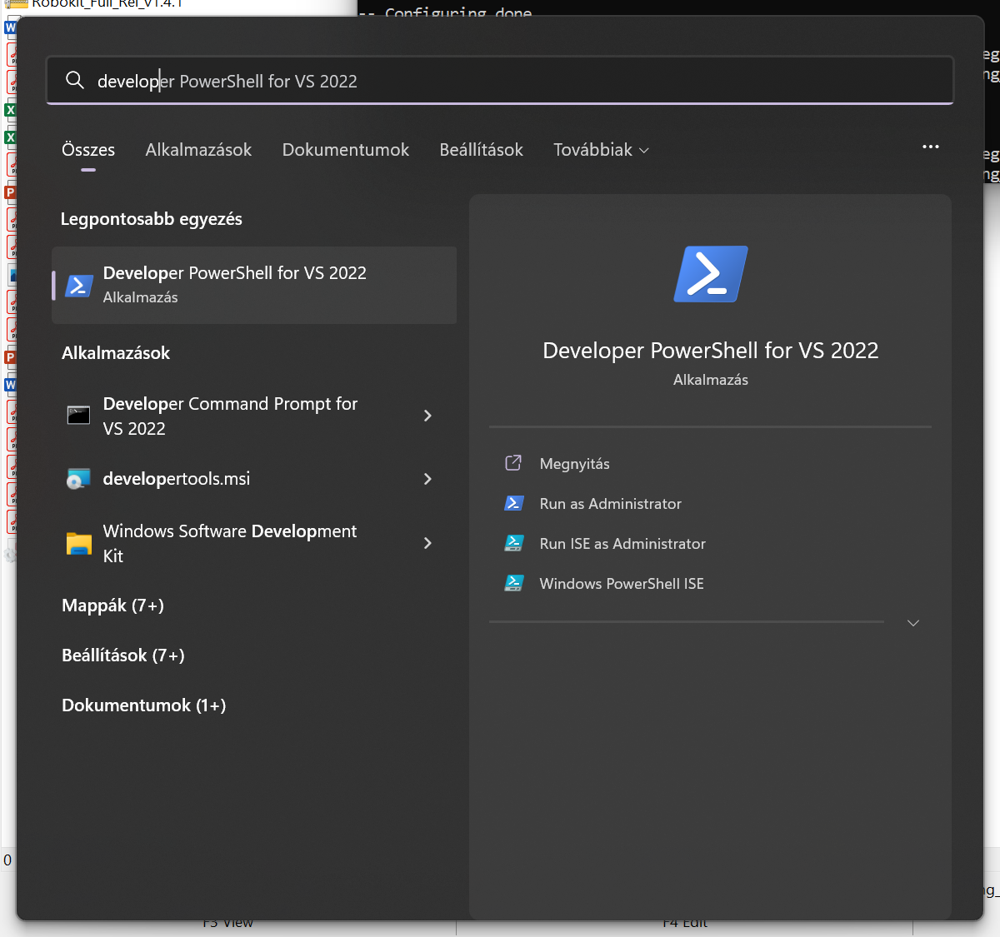
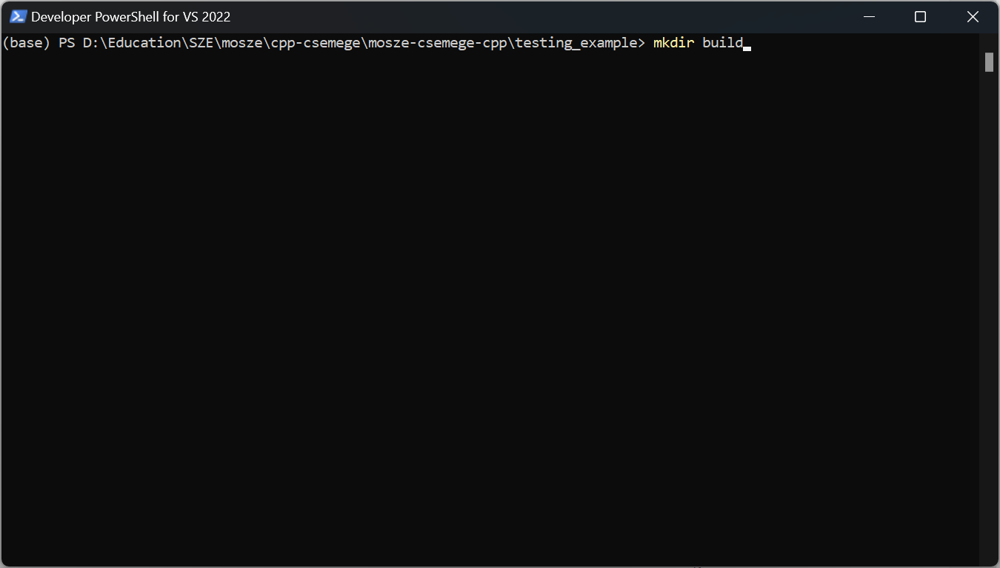
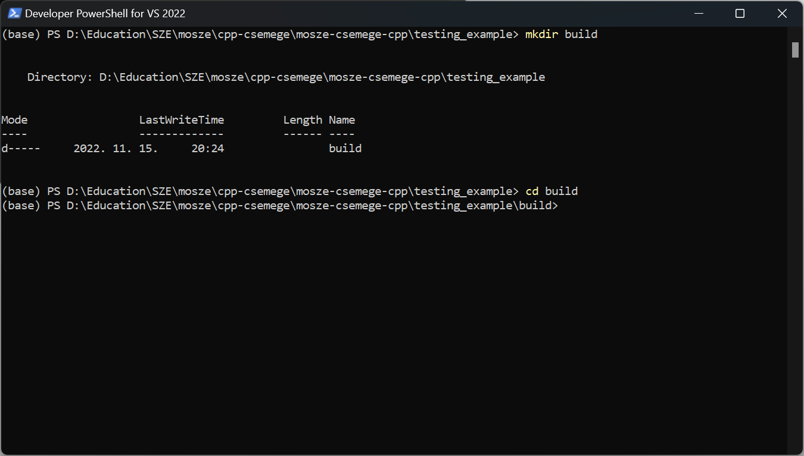
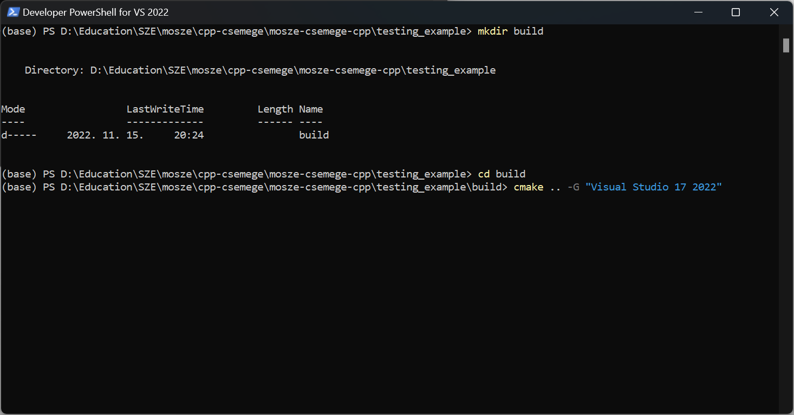
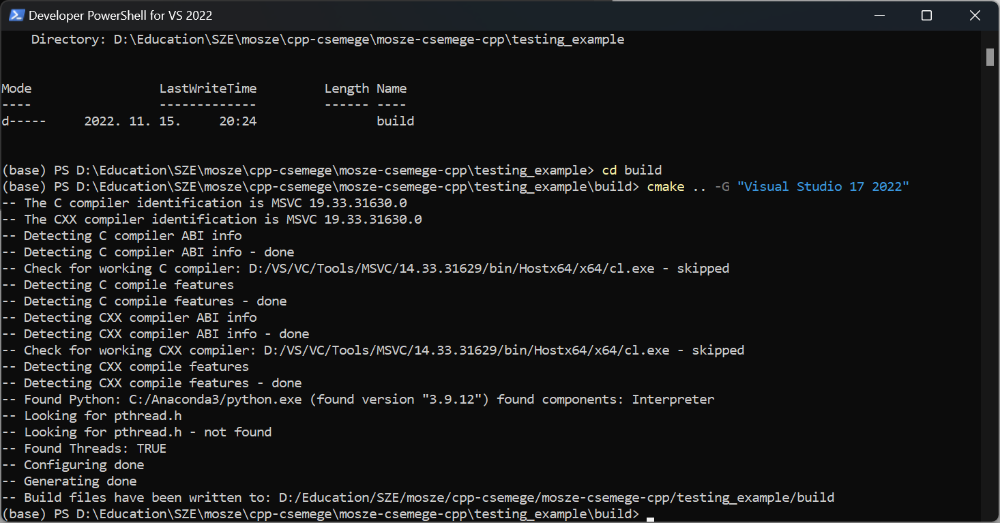
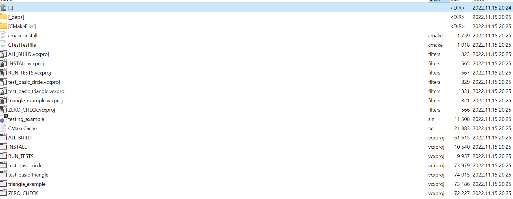
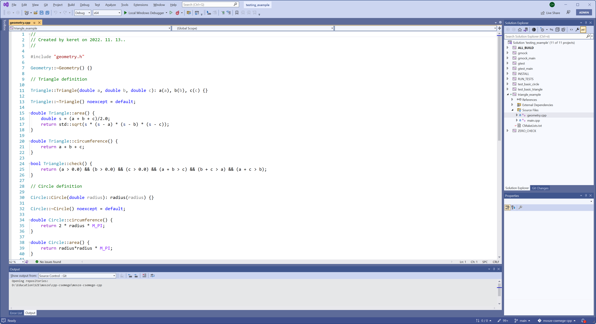

# Modern Szoftverfejlesztési Eszközök (MoSZE) C++ segédanyagok
C++ példák a következő témakörökben:
- CMake
- gtest
- gmock

## Példák tételes felsorolása

1. [Minimális CMake projekt](./01_very_minimal)
1. [GTest mintapélda - alakzatok](./02_testing_example)
1. [Külső könyvtár használata - XML](./03_using_external_library_tinyxml/)


### GTest mintapélda - alakzatok

#### Fejlesztés - Windows és Visual Studio
CMake fájlból generálható Visual Studio solution és projektfájlok tetszés szerint.

Lépések screenshotonként bemutatva:

1. Fejlesztői powershell elindítása a fejlesztőeszközök könnyű elérésére: 
1. Egy új munkakönyvtár létrehozása: ```mkdir build``` 
1. Navigáljunk az újonnan létrehozott könyvtárba: ```cd build``` 
1. Generáljunk Visual Studio solutiont a CMake fájlok alapján: ```cmake .. -G "Visual Studio 17 2022"```
1. Győződjünk meg a sikeres kimenetről: 
1. Solution megnyitása Visual Studio segítségével: 
1. A megnyitott solution: 
